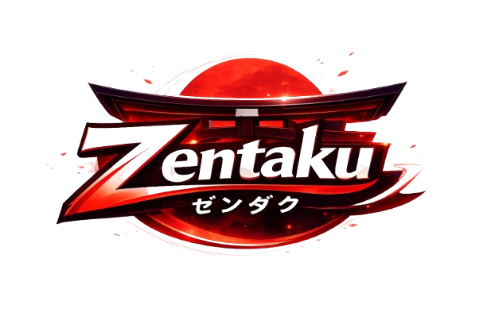

<div align="center">
  
  <h1>Zentaku</h1>
  <p><strong>Stream anime. Read manga. One place.</strong></p>
  <p>A premium, minimalist, and deeply immersive Anime & Manga tracking platform built with Next.js.</p>
</div>

---

## 🌟 Overview

**Zentaku** is a highly polished, dark-mode first web application that bridges the gap between discovering new Manga and streaming your favorite Anime. Built entirely without reliance on third-party public proxy APIs, Zentaku uses a native scraping architecture to provide lighting fast, accurate data.

### ✨ Key Features
- **Ultra-Premium UI:** Built with Tailwind CSS, utilizing stunning glass-morphism, smooth micro-animations, and dynamic mobile-responsive layouts.
- **Anime Streaming & Tracking:** Powered securely via `@consumet/extensions` (`AnimeKai` provider), avoiding DMCA takedowns by utilizing a completely self-sufficient backend API route system. No `.env` proxy configurations required!
- **Manga Vault:** Comprehensive manga tracking and chapter parsing utilizing the **Jikan (MyAnimeList) API** and **MangaDex**. 
- **Lightning Fast Next.js Rendering:** Leverages caching, Server Components, and Next.js 15 App Router architecture for incredibly fast page load times and seamless navigation.

## 🚀 Getting Started

### Prerequisites
Make sure you have Node.js 18+ installed on your machine.

### Installation

1. Clone this repository locally:
```bash
git clone https://github.com/Blanknetework/Zentaku.git
cd Zentaku
```

2. Install the necessary dependencies:
```bash
npm install
```

3. Run the development server:
```bash
npm run dev
```

4. Open your browser and navigate to:
[http://localhost:3000](http://localhost:3000)

## 🛠️ Technology Stack
- **Framework:** [Next.js](https://nextjs.org/) (App Router)
- **Styling:** [Tailwind CSS](https://tailwindcss.com/)
- **Anime Data:** `@consumet/extensions`
- **Manga Data:** [Jikan API](https://jikan.moe/)

## 🎨 Design Philosophy
Zentaku was designed heavily around modern, high-end streaming service aesthetics:
- **Vibrant Identity:** A sleek pitch-black base harmonized with deep glowing red accents.
- **Glassmorphism:** Elegant frosted components and dynamically blurring navigation headers.
- **Adaptive:** Layouts shift intelligently—scaling perfectly to mobile cellular devices, horizontally scrolling on tablets, and utilizing powerful CSS grid rules on ultra-wide desktop monitors.

## 📝 License
This project is for educational and developmental tracking purposes. Data provided by respective scrapers and public APIs are property of their original rightsholders.
